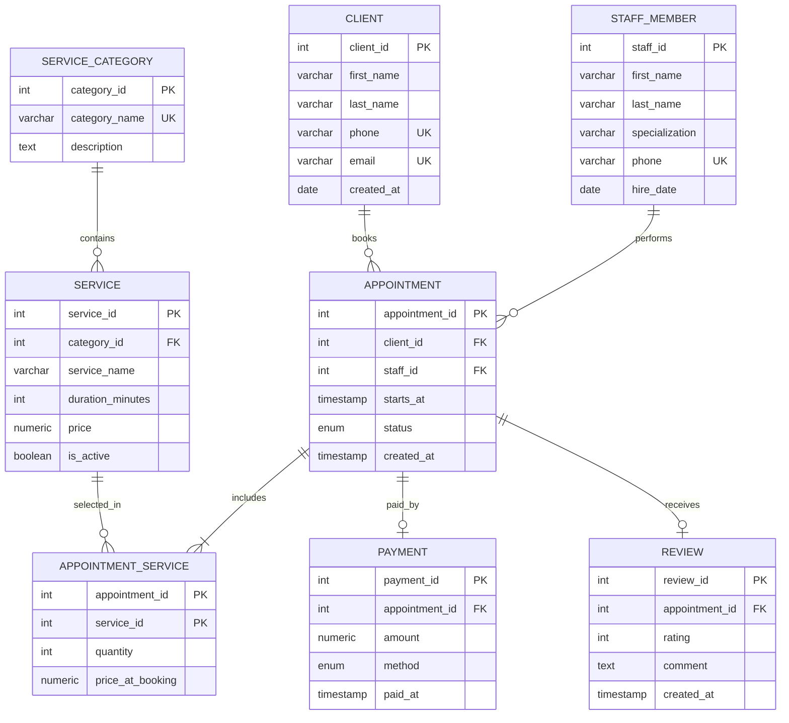

# Лабораторна робота №1

**Тема:** Збір вимог та розробка ER-діаграми  
**Виконала:** Олександра Сандакова, група ІО-41з  
**Предметна область:** система онлайн-запису до салону краси

## Мета роботи

Навчитися збирати вимоги до інформаційної системи, виділяти сутності, атрибути та зв'язки між ними, а також побудувати концептуальну ER-діаграму для подальшої реалізації бази даних у PostgreSQL.

## Опис предметної області

Розглядається система онлайн-запису до салону краси. Система повинна зберігати дані про клієнтів, працівників салону, категорії послуг, самі послуги, записи клієнтів, оплату та відгуки після виконаних процедур.

Основні сценарії:

- клієнт реєструється у системі;
- клієнт обирає одну або кілька послуг;
- адміністратор або клієнт створює запис на конкретну дату і час;
- запис прив'язується до конкретного майстра;
- після завершення запису фіксується оплата;
- клієнт може залишити відгук та оцінку.

## Вимоги до даних

Система повинна зберігати:

- контактні дані клієнтів;
- дані працівників і їхню спеціалізацію;
- перелік категорій послуг;
- перелік послуг з тривалістю та ціною;
- записи клієнтів до майстрів;
- склад кожного запису, оскільки один запис може містити кілька послуг;
- оплату завершених записів;
- відгуки клієнтів.

## Бізнес-правила

- Один клієнт може мати багато записів.
- Один майстер може виконувати багато записів.
- Один запис належить рівно одному клієнту і одному майстру.
- Один запис може включати одну або кілька послуг.
- Одна послуга може входити до багатьох записів.
- Оплата створюється тільки для завершеного запису.
- Для одного запису може бути не більше однієї оплати.
- Для одного запису може бути не більше одного відгуку.
- Рейтинг у відгуку має бути від 1 до 5.

## Сутності та атрибути

**Client** - клієнт салону.  
Атрибути: `client_id` (PK), `first_name`, `last_name`, `phone`, `email`, `created_at`.

**StaffMember** - працівник салону.  
Атрибути: `staff_id` (PK), `first_name`, `last_name`, `specialization`, `phone`, `hire_date`.

**ServiceCategory** - категорія послуг.  
Атрибути: `category_id` (PK), `category_name`, `description`.

**Service** - послуга салону.  
Атрибути: `service_id` (PK), `category_id` (FK), `service_name`, `duration_minutes`, `price`, `is_active`.

**Appointment** - запис клієнта.  
Атрибути: `appointment_id` (PK), `client_id` (FK), `staff_id` (FK), `starts_at`, `status`, `created_at`.

**AppointmentService** - асоціативна сутність між записом і послугою.  
Атрибути: `appointment_id` (PK, FK), `service_id` (PK, FK), `quantity`, `price_at_booking`.

**Payment** - оплата запису.  
Атрибути: `payment_id` (PK), `appointment_id` (FK), `amount`, `method`, `paid_at`.

**Review** - відгук клієнта.  
Атрибути: `review_id` (PK), `appointment_id` (FK), `rating`, `comment`, `created_at`.

## ER-діаграма

Діаграма збережена у файлі [`../diagrams/er_diagram.mmd`](../diagrams/er_diagram.mmd).

## Припущення та обмеження

- Система не моделює зміну робочого графіка майстрів, а тільки фіксує вже створені записи.
- Ціна послуги у записі зберігається в `price_at_booking`, щоб історія оплат не змінювалася після зміни поточної ціни послуги.
- Скасований запис не має оплати.
- Відгук можна залишити лише до конкретного запису, а не до майстра загалом.

## Висновок

У ході роботи було сформовано вимоги до системи онлайн-запису до салону краси, визначено основні сутності, атрибути та зв'язки між ними. Побудована ER-модель є основою для створення реляційної схеми PostgreSQL у наступній лабораторній роботі.
