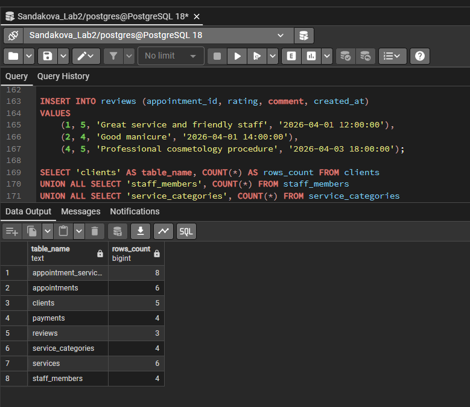
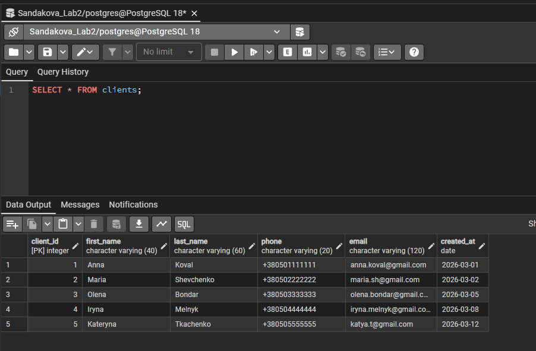
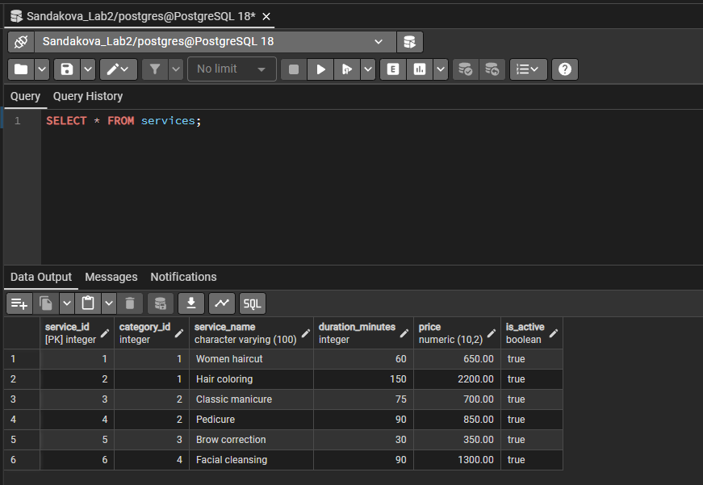
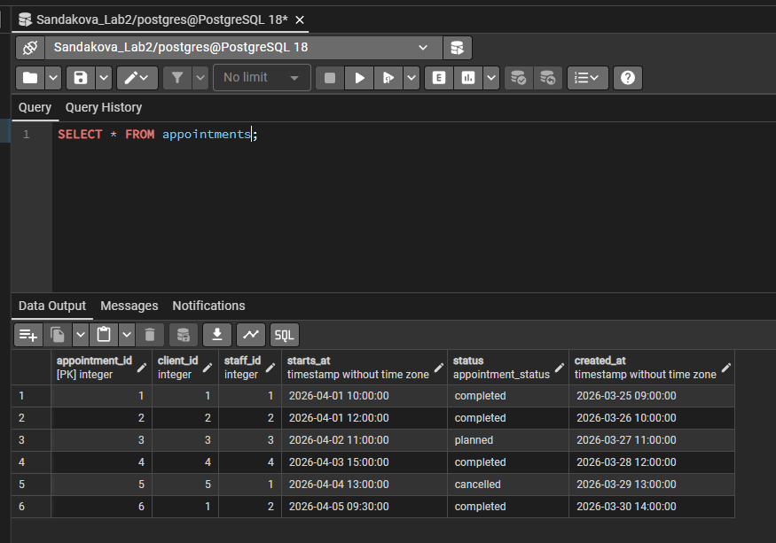
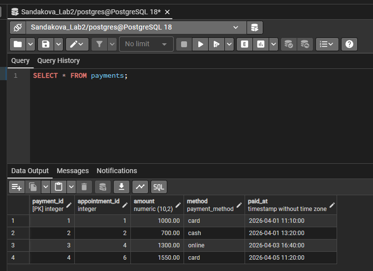

# Лабораторна робота №2

**Тема:** Перетворення ER-діаграми на схему PostgreSQL  
**Виконала:** Олександра Сандакова, група ІО-41з

## Мета роботи

Перетворити ER-діаграму з лабораторної роботи №1 на реляційну схему PostgreSQL, створити таблиці, визначити ключі та обмеження цілісності, а також заповнити таблиці тестовими даними.

## Вихідні дані

Предметна область - система онлайн-запису до салону краси. Основою для побудови схеми є ER-діаграма з файлу [`../diagrams/er_diagram.mmd`](../diagrams/er_diagram.mmd).

## SQL-скрипт

Основний SQL-файл збережено тут: [`../sql/main.sql`](../sql/main.sql).

Файл містить:

- очищення попередніх таблиць через `DROP TABLE IF EXISTS`;
- створення enum-типів `appointment_status` і `payment_method`;
- створення таблиць;
- первинні та зовнішні ключі;
- обмеження `UNIQUE`, `NOT NULL`, `CHECK`;
- тригерну перевірку оплати тільки для завершеного запису;
- тестові дані;
- контрольний запит кількості рядків.

## Побудована схема бази даних

На основі ER-діаграми створено таблиці:

- `clients` - клієнти салону;
- `staff_members` - працівники салону;
- `service_categories` - категорії послуг;
- `services` - послуги;
- `appointments` - записи клієнтів;
- `appointment_services` - послуги в межах конкретного запису;
- `payments` - оплати;
- `reviews` - відгуки.

## Характеристика таблиць

**Таблиця `clients`** містить контактні дані клієнтів.  
Первинний ключ: `client_id`. Унікальні поля: `phone`, `email`.

**Таблиця `staff_members`** містить працівників салону та їхню спеціалізацію.  
Первинний ключ: `staff_id`. Унікальне поле: `phone`.

**Таблиця `service_categories`** містить категорії послуг.  
Первинний ключ: `category_id`. Унікальне поле: `category_name`.

**Таблиця `services`** містить послуги салону.  
Первинний ключ: `service_id`. Зовнішній ключ: `category_id` -> `service_categories(category_id)`. Для ціни та тривалості використано `CHECK`.

**Таблиця `appointments`** описує записи клієнтів до майстрів.  
Первинний ключ: `appointment_id`. Зовнішні ключі: `client_id`, `staff_id`. Обмеження `UNIQUE (staff_id, starts_at)` не дозволяє записати одного майстра на той самий час двічі.

**Таблиця `appointment_services`** реалізує зв'язок багато-до-багатьох між записами та послугами.  
Первинний ключ складений: `(appointment_id, service_id)`.

**Таблиця `payments`** містить оплату запису.  
Первинний ключ: `payment_id`. Поле `appointment_id` є унікальним, тому один запис має не більше однієї оплати.

**Таблиця `reviews`** містить відгуки клієнтів.  
Первинний ключ: `review_id`. Рейтинг обмежено діапазоном від 1 до 5.

## Перевірка у pgAdmin

Після запуску `../sql/main.sql` потрібно виконати:

```sql
SELECT * FROM clients;
SELECT * FROM services;
SELECT * FROM appointments;
SELECT * FROM payments;
```

Скріншоти для вставки:







## Висновок

У лабораторній роботі ER-модель було перетворено на реляційну схему PostgreSQL. Було створено всі необхідні таблиці, ключі, зв'язки та обмеження цілісності. Тестове наповнення демонструє, що схема може зберігати клієнтів, послуги, записи, оплати та відгуки.
