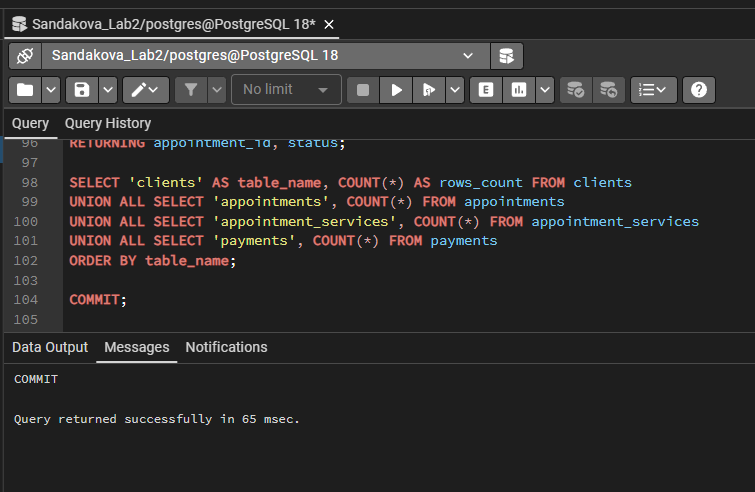
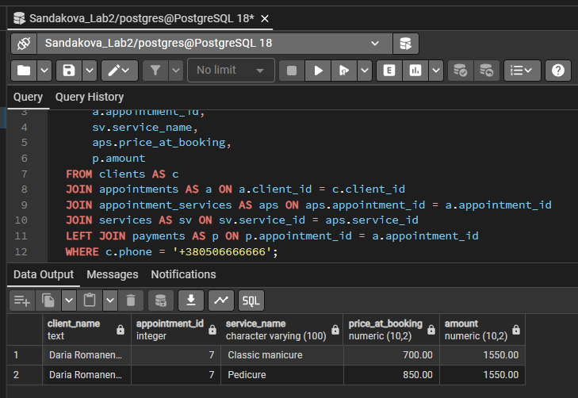

# Лабораторна робота №3

**Тема:** SQL Data Manipulation / OLTP  
**Виконала:** Олександра Сандакова, група ІО-41з

## Мета роботи

Навчитися виконувати базові OLTP-операції над реляційною базою даних PostgreSQL: вибірку, додавання, оновлення та видалення окремих записів.

## Вихідні дані

Використано базу даних з лабораторної роботи №2. Перед запуском цієї лабораторної потрібно виконати [`../sql/main.sql`](../sql/main.sql).

## SQL-скрипт

Основний DML-скрипт збережено у файлі [`lab3_dml.sql`](lab3_dml.sql).

## Опис виконаних запитів

| № | Операція | Мета | Очікуваний результат |
|---|---|---|---|
| 1 | `SELECT` + `JOIN` | Показати заплановані записи з клієнтом і майстром | Повертаються записи зі статусом `planned` |
| 2 | `SELECT` + `JOIN` | Показати послуги конкретного запису | Виводяться послуги запису `appointment_id = 1` |
| 3 | `SELECT` + `WHERE` | Знайти дорогі активні послуги | Повертаються послуги з ціною від 800 грн |
| 4 | `INSERT` | Додати нового клієнта, запис, послуги та оплату | Створюється пов'язаний набір рядків |
| 5 | `SELECT`-перевірка | Перевірити доданий запис | Видно клієнта `Daria Romanenko` та її послуги |
| 6 | `UPDATE` | Перенести запланований запис | Змінюється поле `starts_at` |
| 7 | `UPDATE` | Оновити ціну послуги | Для `Brow correction` встановлюється нова ціна |
| 8 | `DELETE` | Видалити скасований запис | Видаляється запис зі статусом `cancelled` |
| 9 | `SELECT`-контроль | Порахувати рядки в основних таблицях | Показується фінальна кількість рядків |

## Фрагмент DML-сценарію

```sql
WITH new_client AS (
    INSERT INTO clients (first_name, last_name, phone, email, created_at)
    VALUES ('Daria', 'Romanenko', '+380506666666', 'daria.romanenko@gmail.com', '2026-04-06')
    RETURNING client_id
),
new_appointment AS (
    INSERT INTO appointments (client_id, staff_id, starts_at, status, created_at)
    SELECT client_id, 2, '2026-04-08 10:00:00', 'completed', '2026-04-06 10:00:00'
    FROM new_client
    RETURNING appointment_id
)
SELECT *
FROM new_appointment;
```

У повному скрипті цей підхід продовжується для таблиць `appointment_services` і `payments`. Завдяки `RETURNING` ідентифікатори не потрібно підставляти вручну.

## Безпечність змін

Для `UPDATE` і `DELETE` використано конкретні умови `WHERE`. Це важливо для OLTP-запитів, оскільки операції повинні змінювати окремі бізнес-об'єкти, а не всю таблицю.

Приклад безпечного видалення:

```sql
DELETE FROM appointments
WHERE status = 'cancelled'
  AND appointment_id = 5
RETURNING appointment_id, status;
```

## Результати виконання в pgAdmin





## Висновок

У лабораторній роботі виконано базові DML-операції над схемою салону краси. Було отримано дані з фільтрацією, додано новий запис з пов'язаними рядками, оновлено дату запису і ціну послуги, а також безпечно видалено скасований запис.
